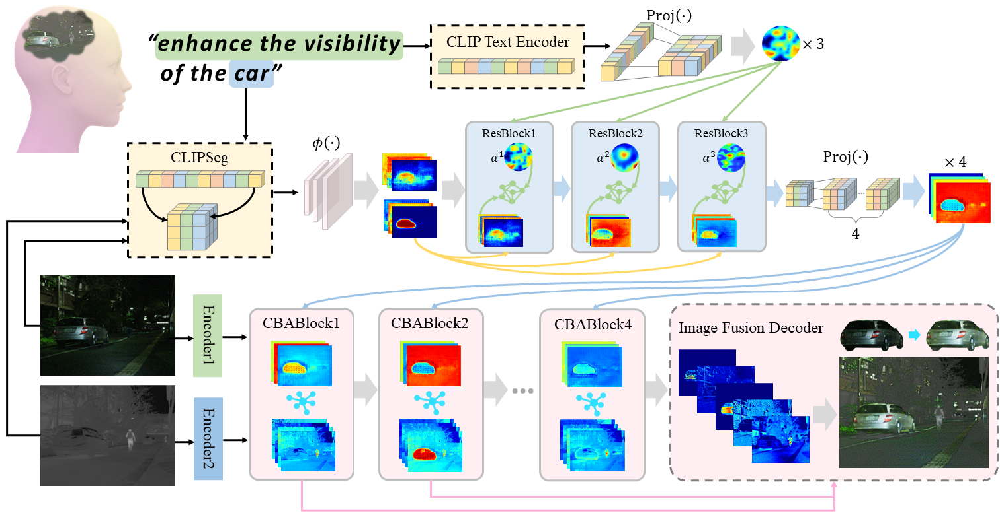

[README .md](https://github.com/user-attachments/files/30152351/README.md)
<div align="center" style="text-decoration: none !important;">
    <h1>
      <a href="https://ojs.aaai.org/index.php/AAAI/article/view/38240" target="_blank" style="text-decoration: none !important;"> 		Robust Fusion Controller: Degradation-aware Image Fusion with Fine-grained Language Instructions (AAAI 2026)
       </h1>
     	<a href='https://github.com/HaoZhang1018' target='_blank' style="text-decoration: none !important;">Hao Zhang<sup>*</sup></a>,&emsp;
    <a href='https://github.com/zhayanping' target='_blank' style="text-decoration: none !important;">Yanping Zha<sup>*</sup></a>,&emsp;
    <a href='#' target='_blank' style="text-decoration: none !important;">Qingwei Zhuang<sup></sup></a>,&emsp;
    <a href='#' target='_blank' style="text-decoration: none !important;">Zhenfeng Shao<sup></sup></a>,&emsp;
    <a href='https://sites.google.com/site/jiayima2013' target='_blank' style="text-decoration: none !important;">Jiayi Ma<sup>&#8224;</sup></a>
</div>


## 🔎 Method Overview



## 🛠️ Create Environment
1. **Clone this repository**

   ```bash
   git clone https://github.com/HaoZhang1018/RFC.git
   cd RFC
   ```
2. **Create Conda Environment**

   ```bash
   conda env create -n RFC -f RFC.yaml
   conda activate RFC
   ```
## 📥 Pre-trained Weights
#### Download the pretrained weight from [Baidu Drive](https://pan.baidu.com/s/1XkPolbqOXGQ8OvIi-bAx7g?pwd=ecjb), and place it in `'model/'`.

## 🏋️ Training

Our project adopts a distributed training mode, you can modify the relevant settings in the `train.py` file to specify the appropriate CUDA device identifier for training. Please store the training data in the following format:

```python
 dataset
 ├──train
    ├── ir
    ├── vi
    ├── text
    └── groundtruth
        ├── ir
        ├── vi
        └── mask
```

Then run:

```python
python train.py
```

## 🧪 Testing

The test data has been prepared in the `dataset` folder. To test a single image, you can use the ⚡`quicktest.ipynb`  for fast and efficient evaluation. Alternatively, you can run the `test.py` script to test your own data by modifying the file path in `test.py` accordingly.

```python
python test.py
```

For various types of degradation removal operations, it is recommended to use the corresponding text in the table below.

| Degradation Type      | Instructions                                                 |
| --------------------- | ------------------------------------------------------------ |
| low-light             | *"enhance the light of the [ ]"*  or  *"make the [ ] brighter"* |
| overexposure          | *"reduce the light of the [ ]"*  or *"make the [ ] darker"*  |
| noise                 | *"reduce the noise of the [ ]"* or *"I want the image to have less noise"* |
| haze                  | *"Reduce the haze of the image"*  or *"'I want the haze of the image to go down'"* |
| flare                 | *"remove the flare of the light"* or *"remove the light of the halo"* |
| blur                  | *"Increase the details of the image''* or *"I want the image to have more texture"* |
| composite degradation | *"enhance the visibility of the [ ]"* or *"make the [ ] clear"* |

The "[ ]" parameter specifies the region you want to enhance, which can be the entire image ("image") or specific local objects such as "car," "building," or "tree."

**😊If this work is helpful to you, please cite it as:**

````
@inproceedings{zhang2026robust,
  title={Robust fusion controller: degradation-aware image fusion with fine-grained language instructions},
  author={Zhang, Hao and Zha, Yanping and Zhuang, Qingwei and Shao, Zhenfeng and Ma, Jiayi},
  booktitle={Proceedings of the AAAI Conference on Artificial Intelligence},
  volume={40},
  number={15},
  pages={12466--12474},
  year={2026}
}
````

